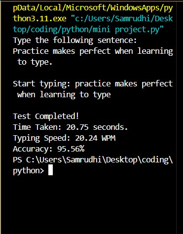

# Typing Speed Test 🖋️⌨️

A simple Python script to test your typing speed and accuracy.

## Features
- Random sentence selection
- Measures Words Per Minute (WPM)
- Calculates accuracy percentage
- Tracks time taken

## Usage

```bash
python typing_speed_test.py
```

## Example Output

```
Type the following sentence:
The quick brown fox jumps over the lazy dog.

Start typing: The quick brown fox jumps over the lazy dog

Test Completed!
Time Taken: 9.83 seconds.
Typing Speed: 49.45 WPM
Accuracy: 100.00%
```

## License
This project is licensed under the MIT License.

---

## 📄 License

This project is licensed under the **MIT License*


## 🖼 Example Output Screenshot

Here’s what the output looks like when you run the script:


